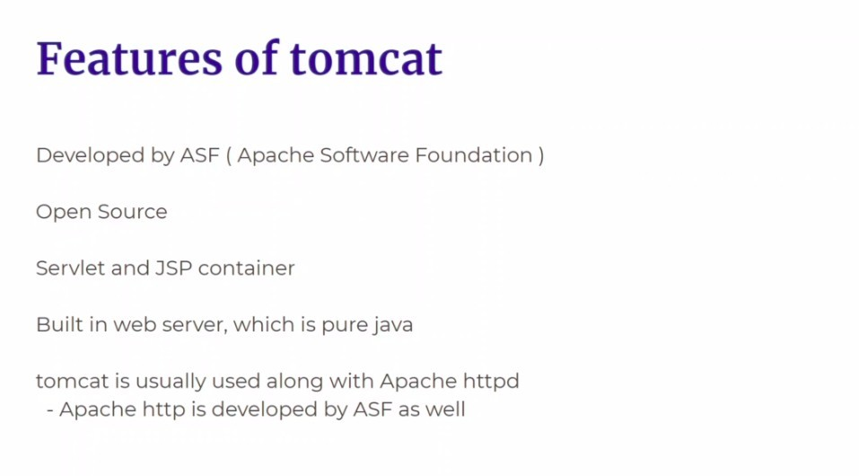
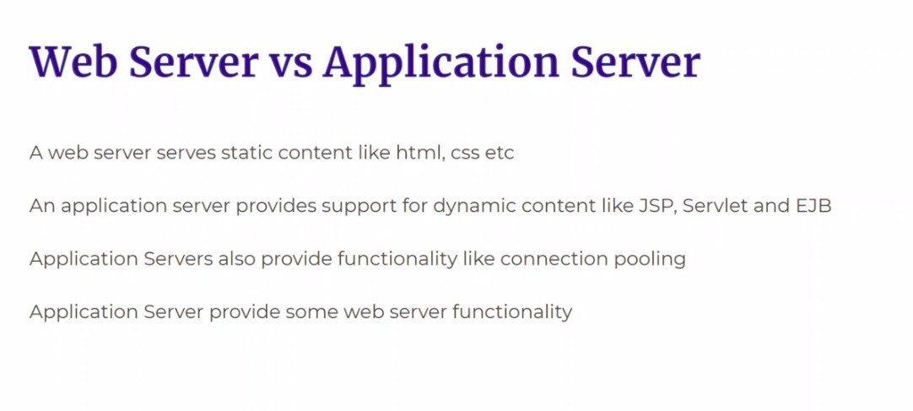
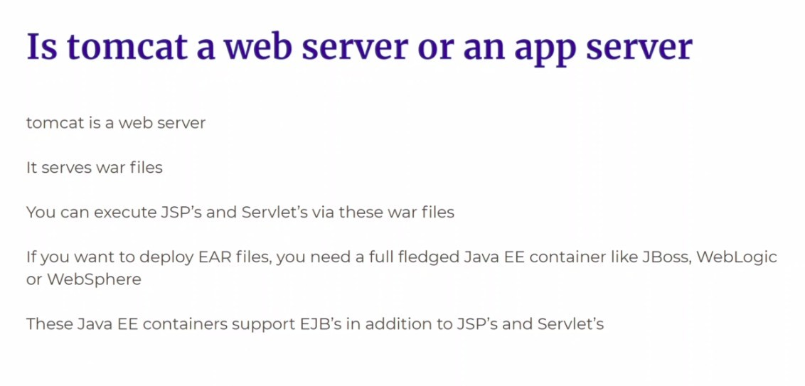

## **Feature of Tomcat**

- A servlet is a Java-based web component or program that runs on a server and is used to extend the capabilities of servers that host applications accessed by means of a request-response programming model. Servlets are most commonly used to process or store data submitted by an HTML form, provide dynamic content, or manage state information between requests.
- JSP (JavaServer Pages) is a Java-based technology used to create dynamic web pages. It is an extension of the Java Servlet technology, which is used to create web pages that are both dynamic and data-driven. A JSP page consists of HTML, XML, and other types of tags and scripts. The code in the JSP page is executed on the server side, and the resulting HTML is sent back to the client. JSP pages can be used to create dynamic web content such as web pages, web applications, and web services.
- Apache HTTP Server, also known as Apache, is a web server application that is widely used for hosting websites and web applications. It is the most widely used web server software on the internet. Apache is open source and freely available under the Apache License. It supports a variety of features such as CGI, SSL, virtual hosting, and URL rewriting. Apache is highly secure and reliable, and is also highly configurable, allowing for easy customization to meet specific needs.

## **Web server vs Application server**

- Enterprise JavaBeans (EJB) is a Java-based software component architecture for developing distributed, transactional, secure and portable applications based on the Java 2 Platform, Enterprise Edition (J2EE). EJB architecture provides a framework for creating distributed applications that can be deployed on any application server that supports the J2EE specification. EJB components are server-side components that are used to encapsulate business logic and provide services to clients. They are typically used to develop enterprise applications that require scalability, availability and security.

## **Tomcat is web server or application server?**

