## **Basic Concept**

### _Java & Other_

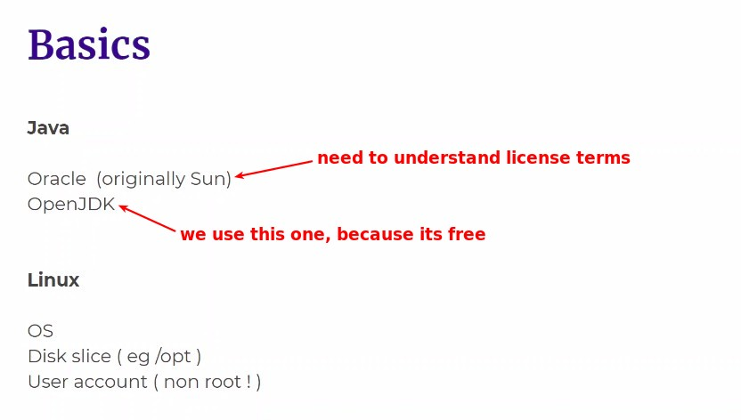

### _Can I use root?_

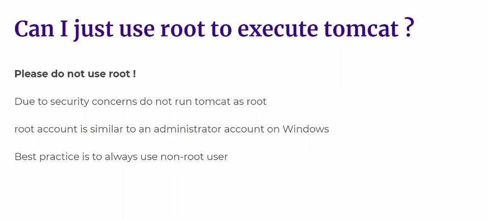

- Create Tomcat with root, if hacked it means all privileges are taken away.
  - So we create a new user with limit privileges to prevent it.

### _Commands_

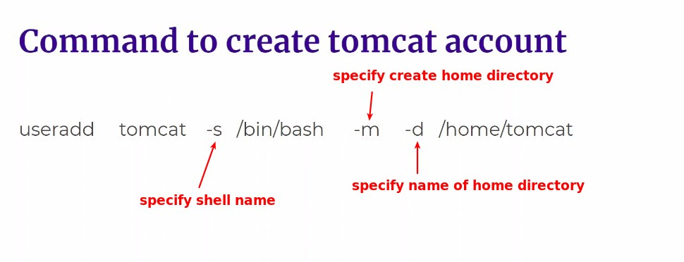

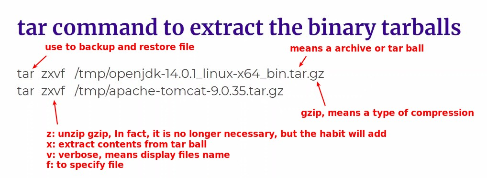

## **Actual Work Flow**

### _Download binary files_

**OpenJDK**

> The lecturer uses 14, I use the latest version 19.

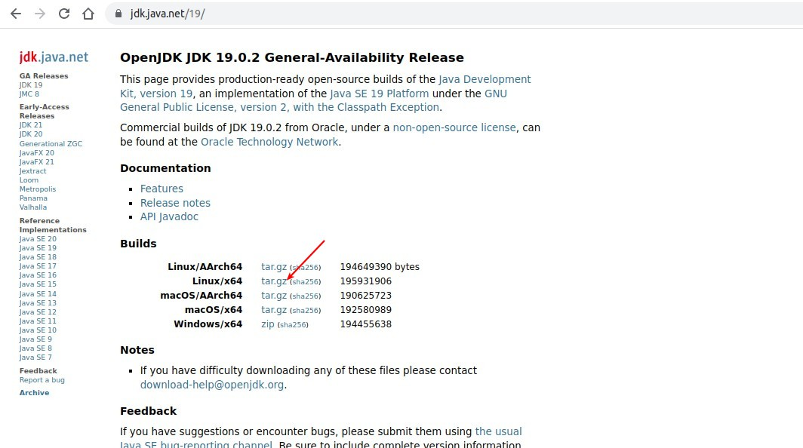

**Tomcat**

> The latest version is 10, I follow the lecture video using 9.

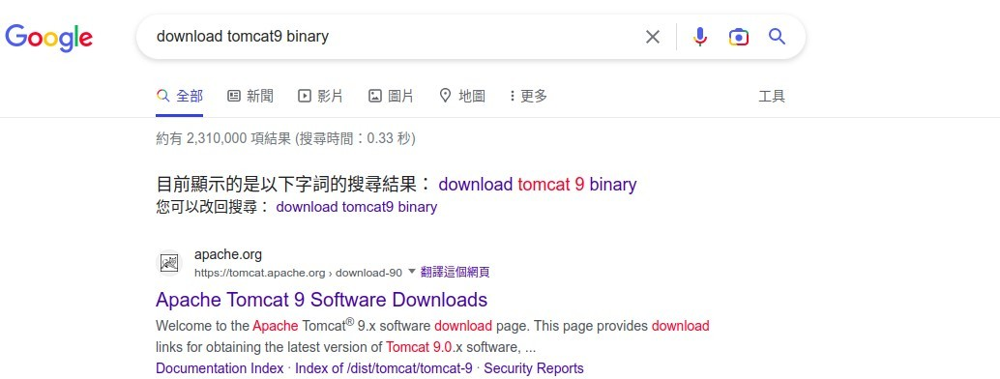

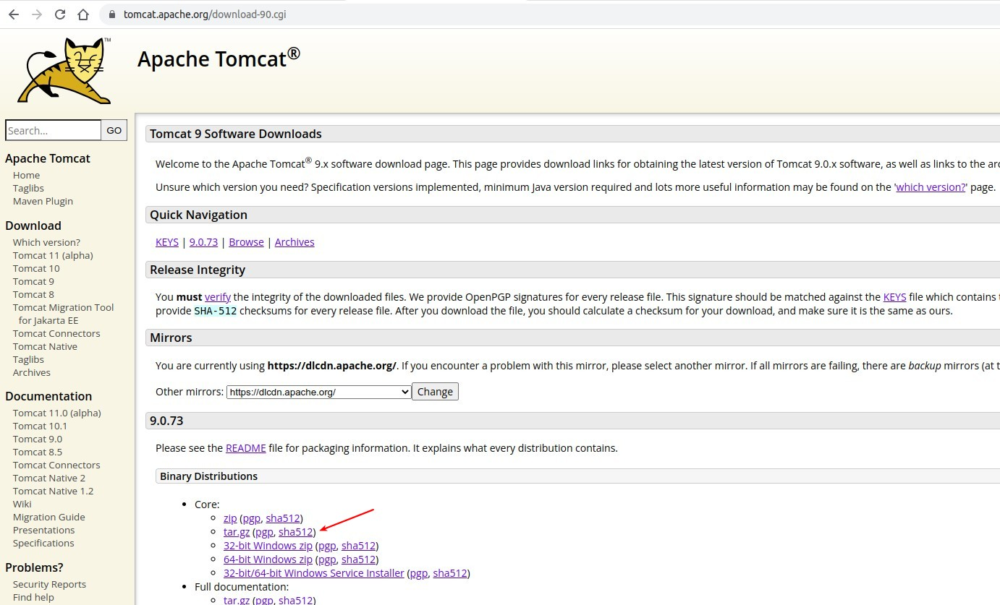

### _Create New User & Disk Slice_

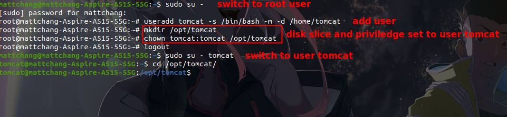

### _Tar binary files_

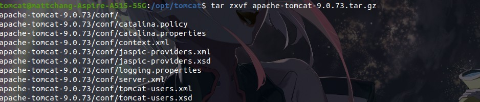

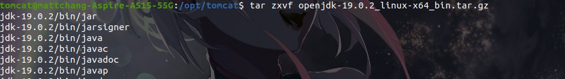

### _set JAVA_HOME & launch Tomcat_

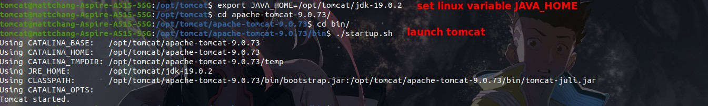

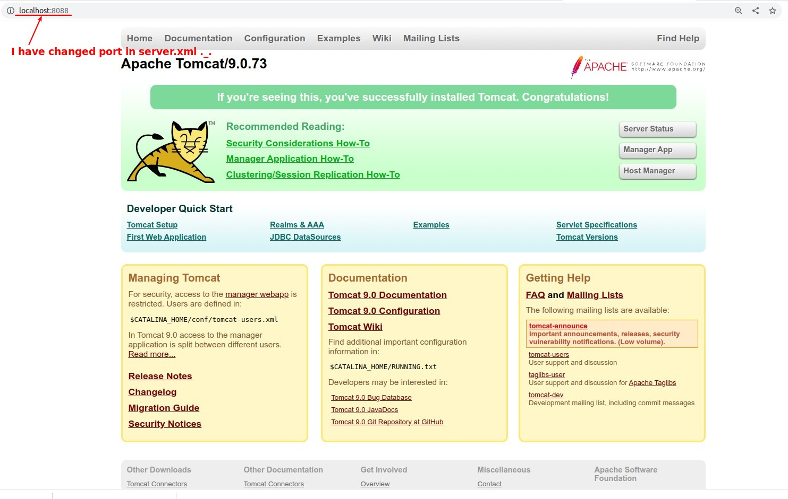

### _shutdown Tomcat_

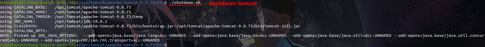
