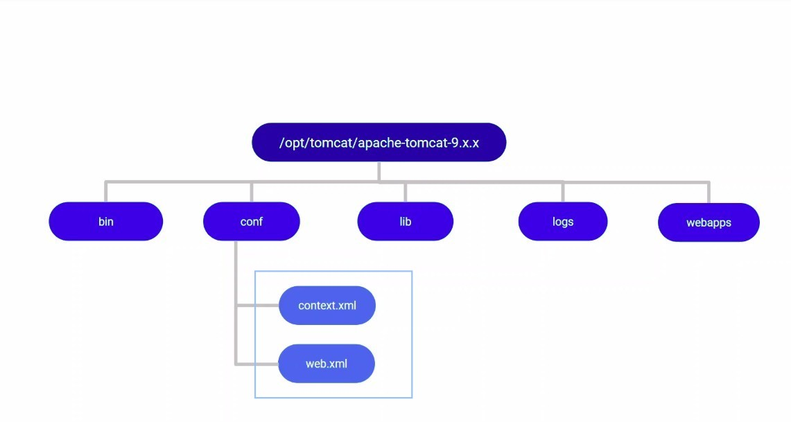
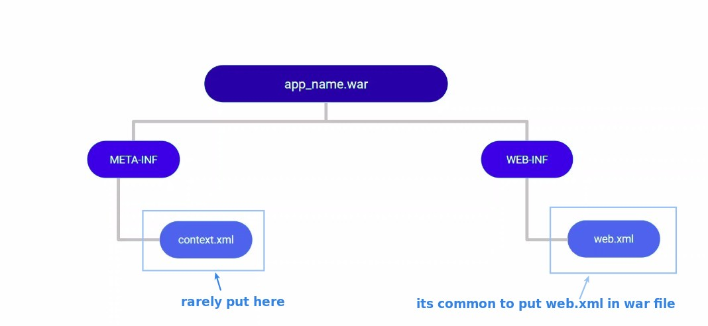
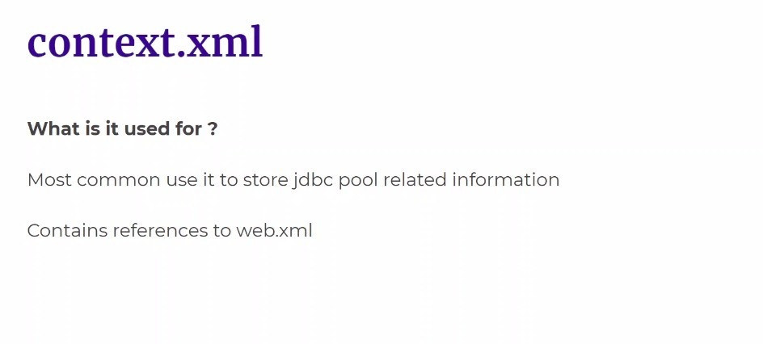
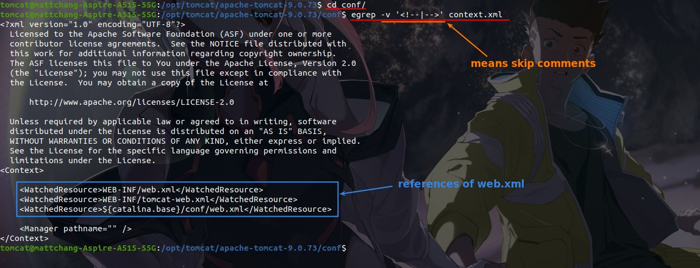
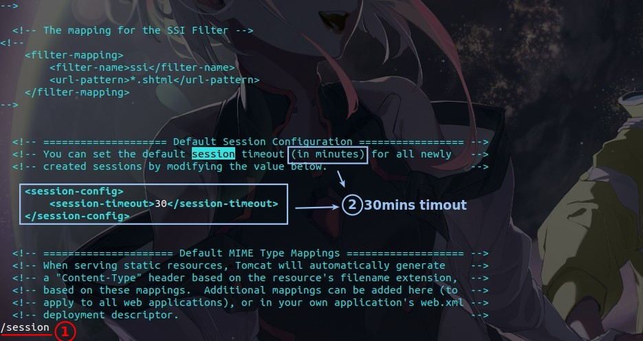
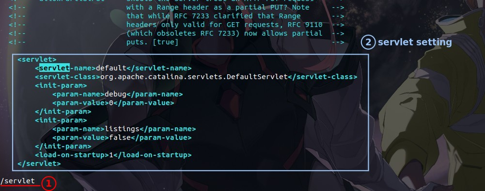
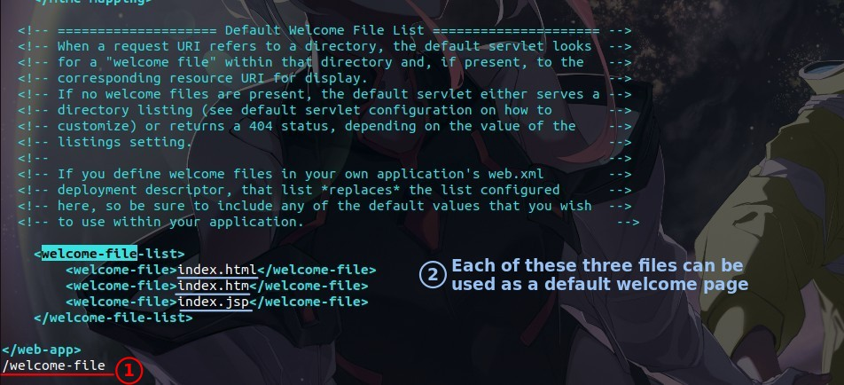

## **Concept**

### _Location of context.xml and web.xml_

- If there is a context.xml under both war and conf, war will override the conf effect, and you can treat the context.xml under conf as a global setting.

### _What context.xml and web.xml for?_

## **Demo**

### _context.xml_

- I don't see jdbc related settings...

### _web.xml_

**Session timout**

**Servlet**

**Welcome-file**

