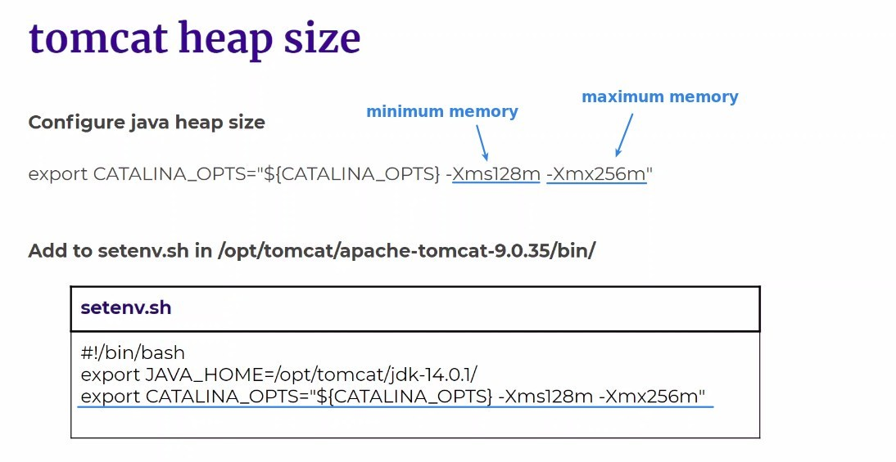
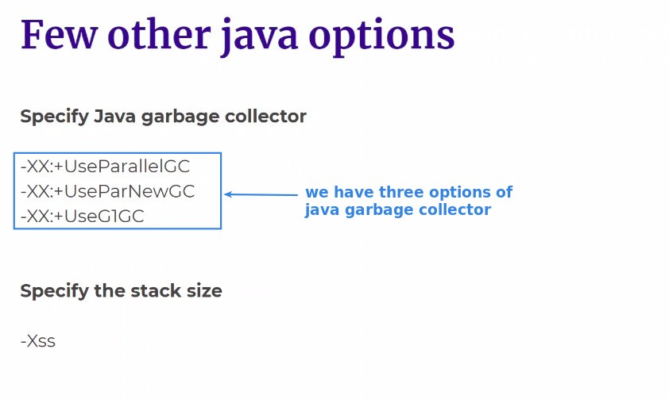
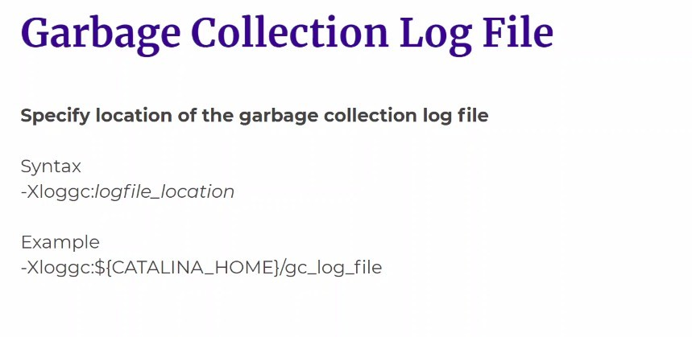
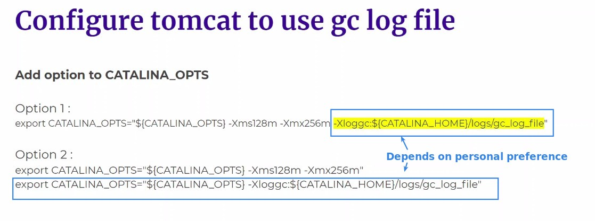
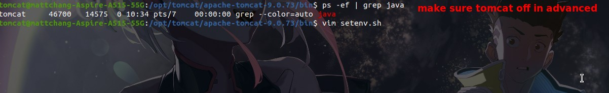
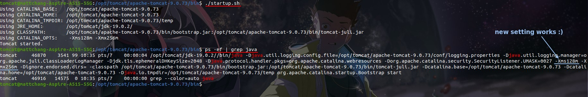
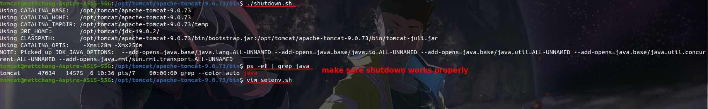
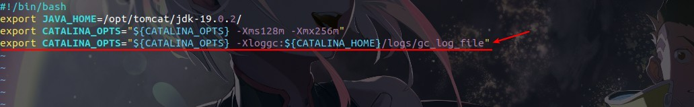
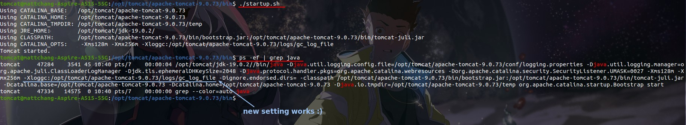
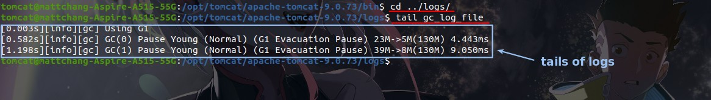

## **Concept**

### _tomcat heap size_

### _few other java options_

### _garbage collection log file_

### _multi-line or single line?_

## **Demo**

### _allocating memory settings_

### _garbage collection log file_

