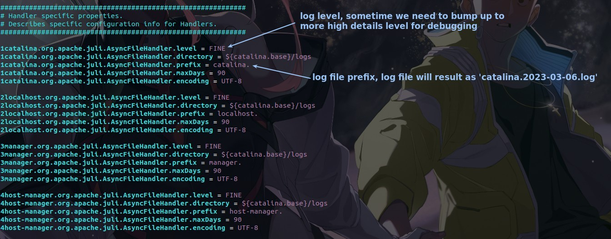
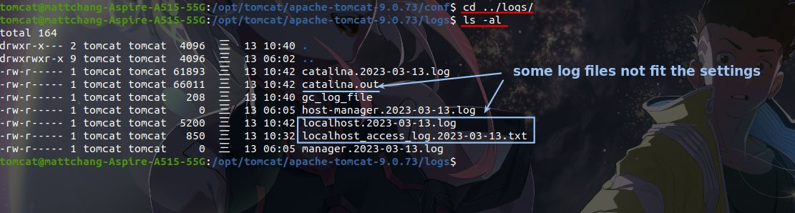
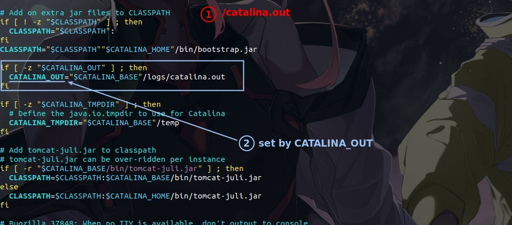
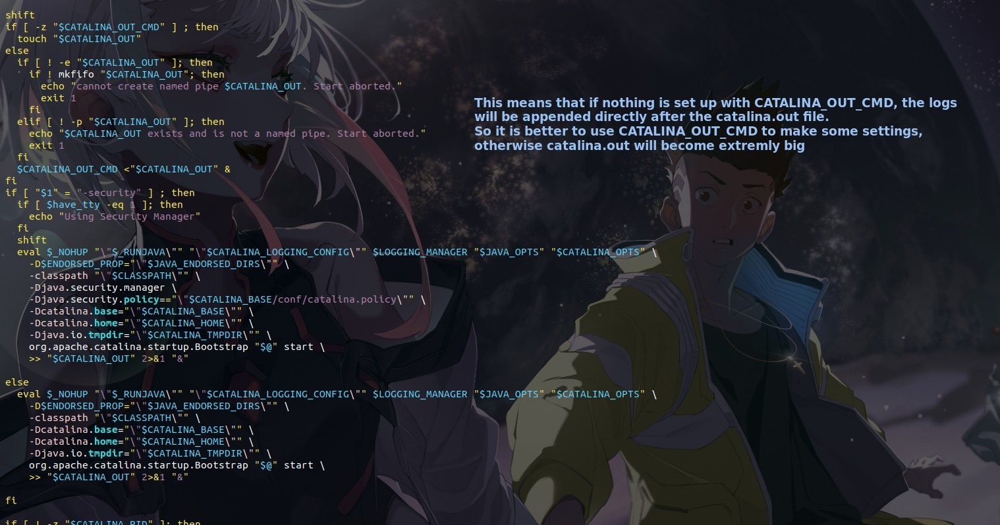
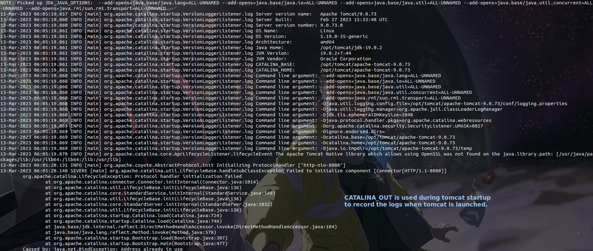

## **logging.properties**

> The general logs are set in the logging.properties file.

## **check /logs**

- Except for the logs files marked in the figure, the names of other logs are set according to logging.properties.

## **catalina.sh**

> catalina.out is set in catalina.sh instead of logging.properties.

## **catalina.out**

> catalina.out is a record of tomcat launch logs, we go in and look at its contents.

- Because the default is to use append, so every time you launch tomcat, it will increase the catalina.out data, which will soon become extremely large.
